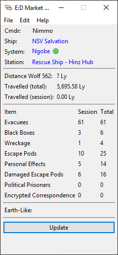

# Evacuation Counter plugin for [EDMC](https://github.com/Marginal/EDMarketConnector/wiki)

This plugin displays number of civilians that you have evacuated from damaged stations.

## Installation

1. On EDMC's Plugins settings tab press the _Open_ button. This reveals the _plugins_ folder where EDMC looks for plugins.
2. Download the [latest release](https://github.com/Nimmo/EvacCount/releases).
3. Open the _.zip_ archive that you downloaded and move the _EvacCount_ folder contained inside into the _plugins_ folder.

You will need to re-start EDMC for it to notice the new plugin.

## Usage

This plugin allows you to count the total number of civilians that you have evacuated from damaged stations. The plugin reads your journal files for any notifications of missions that have been started and then completed.

The count of all evacuated civilians is stored, but can be hidden when not desired. Disable this option if you do not wish to track this number from the options window. It can also be reset from the options menu.

The count of evacuated civilians for the current session has two available options:
* Calculate it for the current EDSM session: Add evacuee counts as long as EDSM runs
* Calculate it for the current Elite Session: Add evacuee counts as long as you don't load into Elite or close EDSM

## Acknowledgments
* This plugin used the DistanceCalc plugin by Thurion which can be found at https://github.com/Thurion/DistanceCalc/
